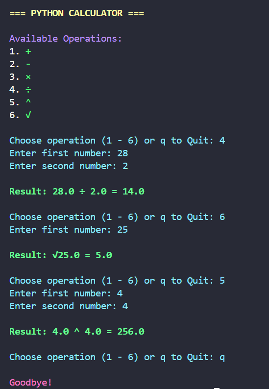

# 🧮 Advanced CLI Calculator

A feature-rich command-line calculator with error handling and color output.



## 🌟 Features
- Basic arithmetic (+, -, ×, ÷)
- Power (^) and square root (√) operations
- Color-coded results and errors
- Input validation for numbers
- Division by zero prevention
- Continuous calculation mode

## 🛠️ Requirements
- Python 3.x
- `colorama` library

## 🚀 Usage
```bash
python calculator.py
```

## ⚙️ Installation
```bash
git clone https://github.com/Parsa-developer/cli-calculator.git
cd cli-calculator
pip install -r requirements.txt